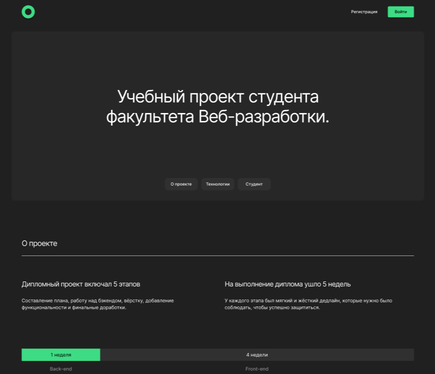
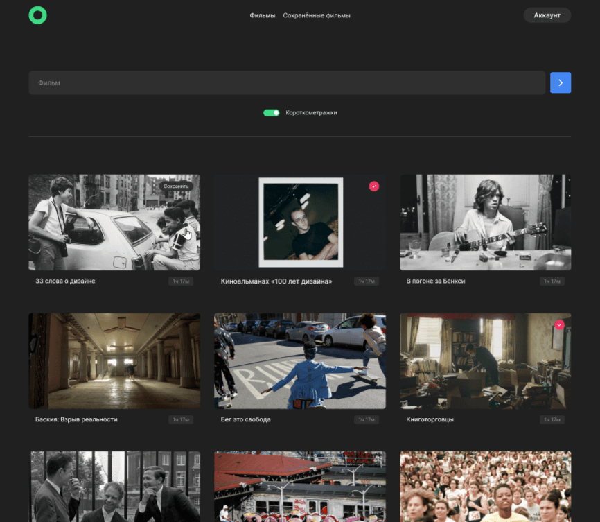

# Movies Explorer
Фронтенд проекта Movies Explorer.

 
### Описание
Адаптивный сайт, включающий в себя лендинг-портфолио и сервис для поиска фильмов. 

Основной функционал:
- Регистрация/Авторизация
- Редактирование профиля
- Сохранение и удаление фильмов в избранное
- Поиск фильмов как на русском языке, так и на английском
- Фильтр короткометражных фильмов
- Живая валидация всех форм
- "Выезжающее" меню на малых разрешениях экрана
- Кнопка "ещё" для отображения большего количества фильмов

### Стэк примененных технологий:
1. HTML
2. CSS
3. React
4. Node.js

### Инструкция по развертыванию:
1. Запустить [backend](https://github.com/AntonChernikov2407/movies-explorer-api)
2. Скопировать репозиторий `git clone git@github.com:AntonChernikov2407/movies-explorer-frontend.git`
3. Перейти в директорию проекта и установить зависимости `npm i`
4. Запустить проект `npm start`
